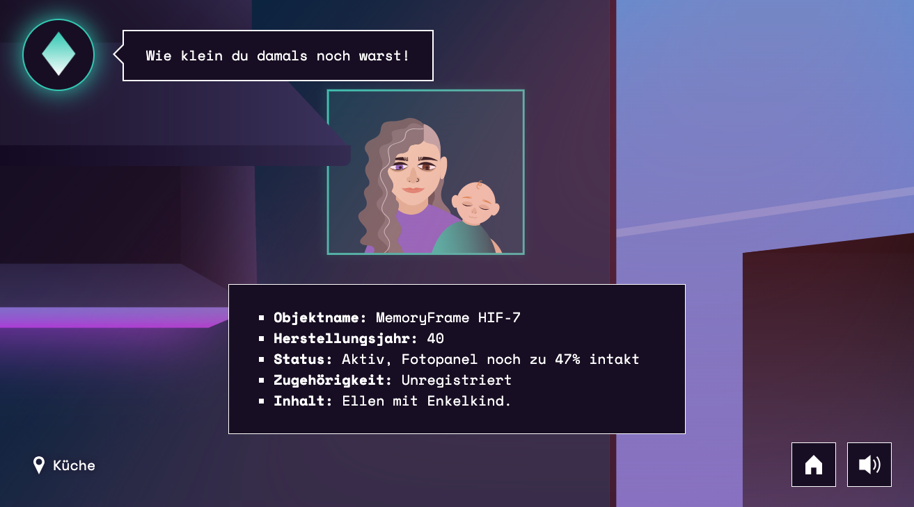
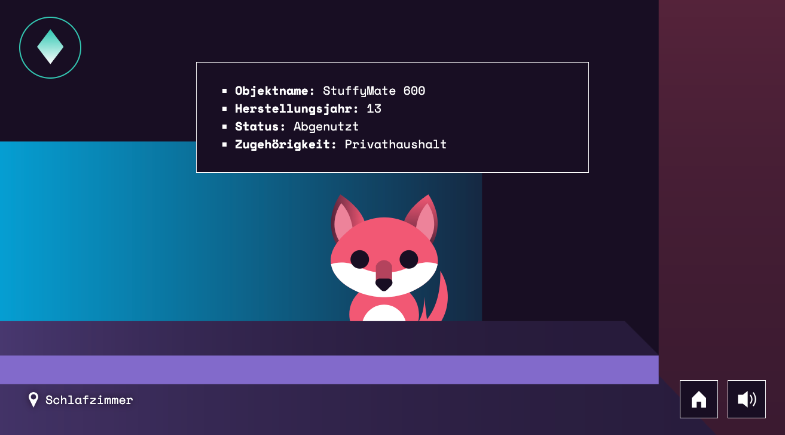
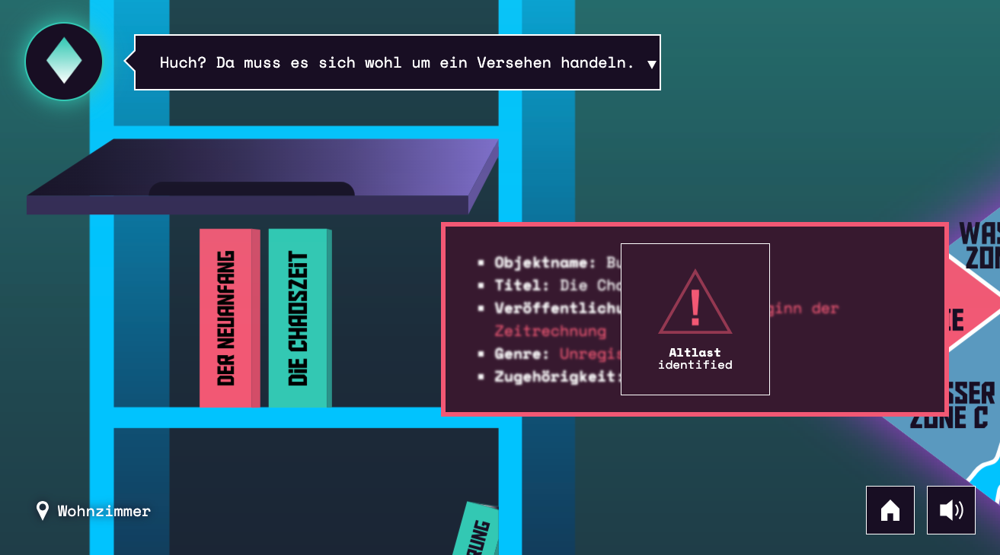

# Altlast

[](https://itch.io/)

<p align="center">
  
  
</p>
<p align="center">
  
  
</p>

## Description

This project is a narrative-driven political game about historical amnesia and responsibility in a fictional, futuristic society.

The player explores the apartment of a recently deceased grandmother and uncovers fragments of a suppressed past. While the world presents itself as stable and progressive, memory itself has become a political liability. Through exploration and object analysis, the game invites reflection on how societies remember, forget and normalize political systems.

The game does not aim to teach historical facts, but to create an emotional experience of political responsibility and forgetting.

The game is hosted and playable on https://altlast.noracudazzo.com. 

## Context

This project was developed as part of a Bachelor thesis in the field of design.

The thesis explores digital games as a political medium with a focus on memory culture, historical amnesia and individual responsibility. The game serves as a practical case study examining how political systems and processes of forgetting can be experienced through interaction rather than factual representation.

## Language

The game is available in **German only**.

## How to play

- Progress linearly through the apartment
- Analyze objects to uncover fragments of the present and past  
- Use the assistant to navigate — and question its role

The game is **desktop-first** and designed to be played with a mouse and headphones.

## Development

This game is distributed as a `Single Page Application` using plain `JavaScript`. The project uses [Vite](https://vite.dev/) as build tool and therefore relies on [NodeJS](https://nodejs.org) and `npm` (or a package manager of your choice). The following commands will install the dependencies, start a local development server and build the application:

```bash
npm install   # installs project dependencies via node package manager
npm run dev   # starts development server
npm run build # generates a production build in directory ./dist
```